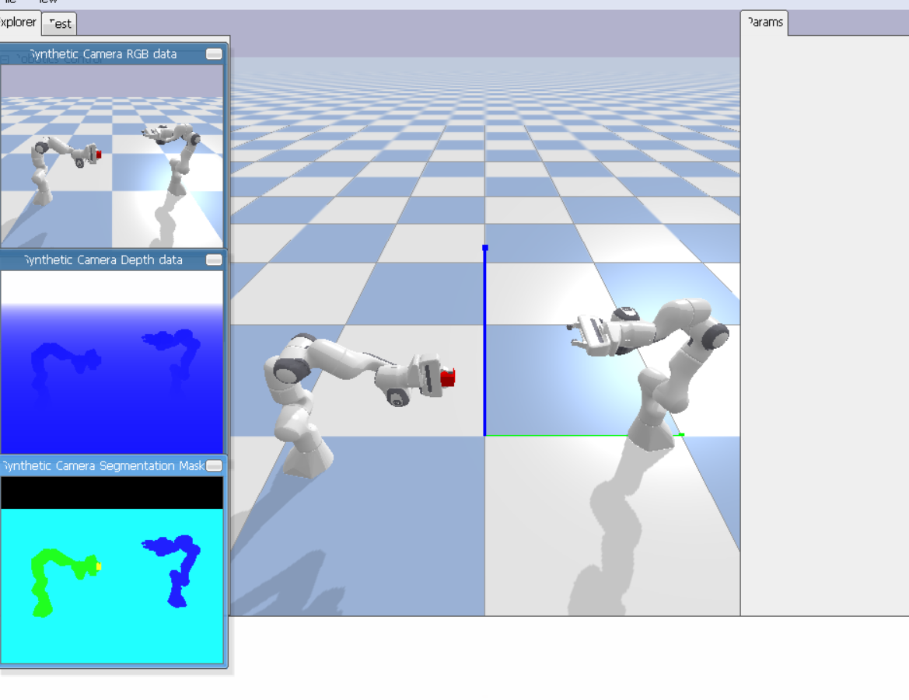

## Project Description
The objective of this project is to provide a robust framework for recording expert demonstrations. We utilize a Franka Panda robotic arm to perform complex manipulation tasks. The system captures synchronized multimodal data—including joint states, velocities, and multi-angle camera feeds—and exports them into a structured HDF5 format. This format is optimized for high-speed data loading during the training of deep learning architectures like the Action Chunking Transformer (ACT).
## Task 1: Stacking Task
### Domain RandomizationTo ensure the policy generalizes well, the simulation incorporates randomization for every new episode:
Initial Positions: Blocks are placed at random $(x, y)$ coordinates within the designated workspace.
Orientation: Random yaw rotations are applied to the blocks, forcing the robot to adapt its grasp approach.
## HDF5 Data Structure (Stacking)
The recorded data follows a strict hierarchy to ensure compatibility with training pipelines:
graph TD;

    A[episode_XX.hdf5] --> B[observations]
    A --> C[action]
    B --> D[qpos: 7-DoF + Gripper State]
    B --> E[qvel: Joint Velocities]
    B --> F[images]
    F --> G[top_cam: RGB/Depth]
    F --> H[wrist_cam: RGB/Depth]
    C --> I[Target Joint Positions]


## Task 2: Transfer Task
The Transfer Task requires the robot to pick an object from a starting location and move it safely into a target bin or container. This emphasizes trajectory planning and steady motion control.
## Getting Started
### Prerequisites
Ensure you have the following dependencies installed:

* Python 3.8+

* pybullet

* h5py

* numpy

### Execution
Run the following commands to start the simulation and data collection:

To run the Stacking Task:
```bash
python stacking_task/main.py
```
```bash
python transfer_task/main.py
```


## Visuals
### Stacking Task Demo

### Transfer Task Demo

